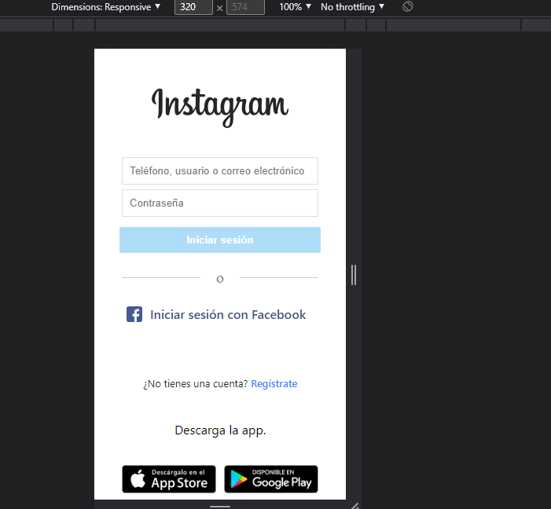
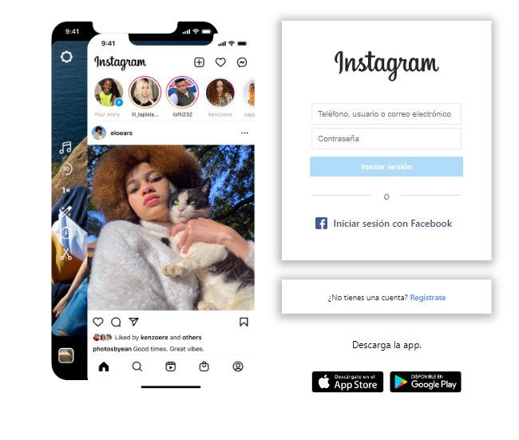
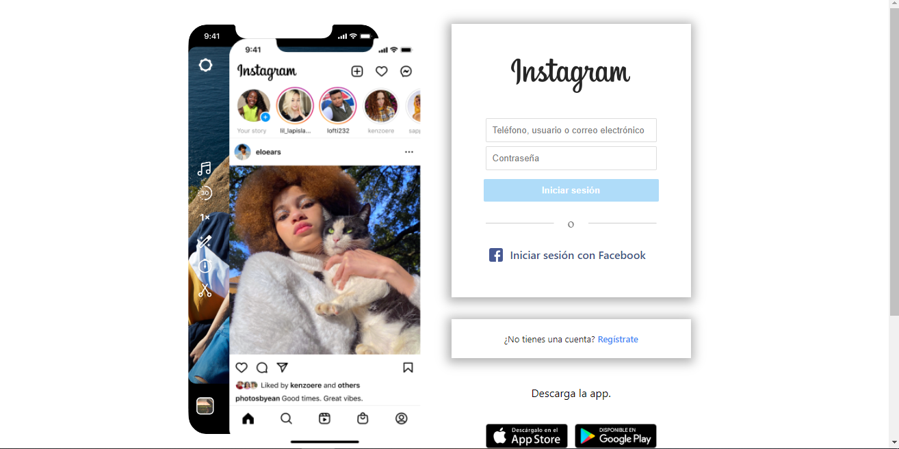

# Instagram Clone
-  Realizado con HMTL5, CSS3 para practicar maquetación donde se adapta a diferentes disposivitos móviles.

- Dispositivos de 320px a 450px

- Dispositivos de 450px a 860px

- Desktop

